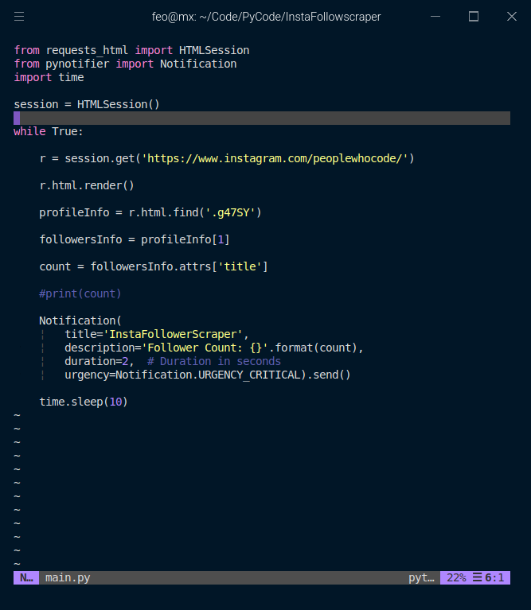

# Insta-Follower-Count-Scraper

This is a minimal web scraping project showcasing use of requests-html and py-notifier for sending out desktop notifications

> The script when run, goes to a given instagram profile url and scrapes the follower count and send out a desktop notification with the latest follower count. The script runs every 10 seconds. requests-html is used for scraping and py-notifier is used for sending out desktop notification.

---

## Usage

> Clone the repo
`$ git clone https://github.com/VishnuDileesh/Insta-Follower-Count-Scrapper`

> Change to the cloned repo

`$ cd Insta-Follower-Count-Scrapper`

> Install the necessary packages

`$ pip3 install -r requirements.txt`

> Running the project

`$ python3 main.py`

> To change the url

`open the main.py file in an editor & inspect the code to make changes`

